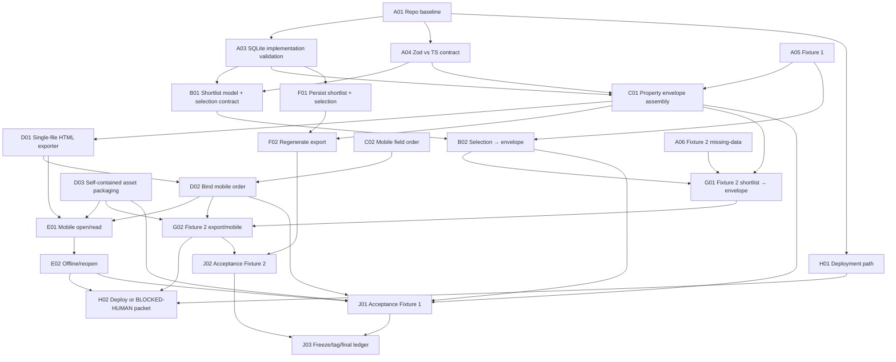

# Ashante MVP — Frozen Assembly & Production Map

Status: CONTROL HARNESS
Authority: Operator-approved production map
Rule: This map may be updated for task state/evidence, but its production topology, acceptance gates, and MVP destination must not be silently changed. Any topology/scope change requires an explicit operator decision recorded in the change log.

## Frozen destination

DESKTOP SHORTLIST → SELECT PROPERTY → PROPERTY ENVELOPE → SELF-CONTAINED HTML EXPORT → MOBILE OPEN/USE → OFFLINE REOPEN → REPEAT WITH SECOND PROPERTY → FINAL ACCEPTANCE → PROMOTION

## Worker topology

- Operator: root authority; scope/topology changes; manual validator dispatch.
- ChatGPT Cloud / co-orchestrator: logistics, dependency tracking, worker allocation, queue state, handoffs, and map reconciliation.
- GPT Work — User: primary builder for foundation/data spine/shortlist/export/persistence/deployment lanes.
- GPT Work — Ashante: primary builder for fixtures/property-envelope/mobile/second-property/operator-use lanes.
- Cheap/Secondary workers: bounded fixtures/docs/preprocessing work.
- Gemini Spark: operator-triggered independent validator. Validates only against pre-existing contract. Does not invent requirements.
- Anti-Gravity: foundry/specialist lane; not assumed to be a persistent queue worker. Use on demand when its environment economics make sense.

## Assembly map

## Parts register / check-off joints

State legend: `[ ]` not accepted; `[B]` built/staged; `[V]` validation pending; `[x]` independently PASSed; `[R]` rework; `[!]` blocked.

| Joint | Part / required output | Producer | Acceptance gate | State | Artifact / commit / evidence |
|---|---|---|---|---|---|
| A01 | Baseline repo health/build/typecheck snapshot | Specialist/reassigned builder | Baseline captured and reproducible | [ ] | |
| A02 | Frozen MVP scope + source-of-truth pointers | GPT Work — User | Scope and authority pointers explicit | [ ] | |
| A03 | SQLite implementation conformance | GPT Work — User | Zero mismatch or bounded repair list | [ ] | |
| A04 | Zod ↔ canonical TS conformance | GPT Work — Ashante | Required fields validate; no silent coercion | [ ] | |
| A05 | Property Fixture 1 | GPT Work — Ashante | Valid fixture enters app | [ ] | |
| A06 | Property Fixture 2 / missing-data profile | Cheap/Secondary | Exercises missing-data path | [ ] | |
| B01 | Shortlist model + selection contract | GPT Work — User | Deterministic shortlist/select | [ ] | |
| B02 | Selection → envelope assembler wiring | GPT Work — User | No manual stitching | [ ] | |
| C01 | Property-envelope assembly | GPT Work — Ashante | Required fields + provenance/missing markers | [ ] | |
| C02 | Mobile-critical field order | GPT Work — Ashante | Auction-use ordering frozen | [ ] | |
| C03 | Missing/unavailable behavior | GPT Work — Ashante | Missing data explicit; never invented | [ ] | |
| D01 | Single-file HTML exporter | GPT Work — User | One portable HTML artifact | [ ] | |
| D02 | Mobile ordering bound to HTML | GPT Work — Ashante | Export follows frozen mobile order | [ ] | |
| D03 | Self-contained asset packaging | Specialist/reassigned builder | No broken external asset dependency | [ ] | |
| E01 | Target-phone open/read | GPT Work — Ashante | Core information usable on phone | [ ] | |
| E02 | Offline/reopen | GPT Work — Ashante | Artifact reopens without network | [ ] | |
| F01 | Persist shortlist/selection | GPT Work — User | State survives normal reopen | [ ] | |
| F02 | Regenerate export from persistence | GPT Work — User | No one-off state needed | [ ] | |
| G01 | Fixture 2 shortlist → envelope | GPT Work — Ashante | Second property works without source edit | [ ] | |
| G02 | Fixture 2 export/mobile | GPT Work — Ashante | Second property exports/opens | [ ] | |
| H01 | Vercel-ready path/env assumptions | Specialist/reassigned builder | Code vs human-auth blockers classified | [ ] | |
| H02 | Deployment or BLOCKED-HUMAN packet | GPT Work — User | Live deploy or exact human blocker | [ ] | |
| I01 | Runbook | Cheap/Secondary | Another worker can execute workflow | [ ] | |
| I02 | Deferred-scope backlog | GPT Work — Ashante | Non-MVP ideas outside active build | [ ] | |
| J01 | End-to-end Fixture 1 acceptance | Independent validator | Full vertical slice PASS | [ ] | |
| J02 | End-to-end Fixture 2 acceptance | Independent validator | Repeatability PASS | [ ] | |
| J03 | MVP freeze/tag/final ledger | Promotion worker | Known-good state frozen and referenced | [ ] | |

## Production rules

1. The map is the assembly schematic; the shared Drive queue is the live dispatch/state surface.
2. A worker may build a part only within the frozen MVP and its assigned joint.
3. BUILT is not PASS. Independent validation is required before a hard dependency unlocks.
4. Validator failure must identify REQUIREMENT → OBSERVED RESULT → MISMATCH. Possible improvement is not failure.
5. Independent work may continue while another branch waits for validation.
6. Incoming worker artifacts are staged and attached to their joint by artifact/evidence reference.
7. No worker may silently add, remove, reorder, or redefine joints or acceptance gates.
8. If a requirement genuinely changes, record an explicit operator-approved map revision in the change log before using the new topology.
9. Final product promotion occurs only after required joints PASS and the two end-to-end acceptance joints PASS.
10. A replacement orchestrator must be able to reconstruct remaining work from this file plus the shared queue and referenced artifacts.

## Reconciliation procedure

At each orchestration checkpoint:

1. Read the shared queue.
2. Compare queue states with this parts register.
3. Attach new artifact/evidence references to the corresponding joint.
4. Update only the joint state/evidence fields unless the operator explicitly authorized a topology change.
5. Release downstream work only from independently PASSed prerequisite joints.
6. If the queue and map disagree, treat the disagreement as a control-plane exception; do not silently choose a new production path.

## Change log

- Initial map: frozen from the Ashante MVP universal verification queue and current operator orchestration model.
